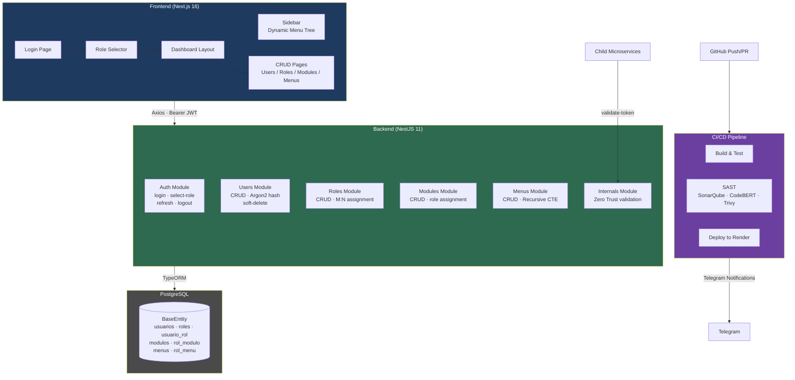

# Master Gateway

**Sistema Centralizado de Autenticación y Autorización** basado en principios de **Shift-Left Security** y **Zero Trust Architecture**. Actúa como gateway de seguridad para un ecosistema de microservicios.

> **Universidad de las Fuerzas Armadas ESPE** — Desarrollo de Software Seguro  
> Prof. Geovanny Cudco — Julio 2026

---

## Arquitectura de la Aplicación



---

## Pipeline de CI/CD


El pipeline implementa tres workflows en GitHub Actions:

| Workflow | Disparo | Descripción |
|---|---|---|
| **build.yml** | Push/PR a dev/test/main | Lint, build, tests unitarios, auto-merge dev→test→main |
| **sast.yml** | PR a test o manual | SonarQube, CodeBERT (HuggingFace), Trivy, quality gate |
| **deploy.yml** | Push a main o manual | Deploy a Render vía webhook |

Todas las etapas notifican a Telegram mediante `appleboy/telegram-action`.

---

## Stack Tecnológico

| Capa | Tecnología |
|---|---|
| **Backend** | NestJS 11, TypeScript, Passport.js + JWT, Argon2 |
| **Frontend** | Next.js 16, React 19, Zustand 5, Tailwind CSS 4, Radix UI |
| **Base de Datos** | PostgreSQL, TypeORM 1.1 |
| **SAST / Análisis** | SonarQube, CodeBERT (HuggingFace), Trivy |
| **CI/CD** | GitHub Actions, Render, Docker (Alpine Node 22) |
| **Notificaciones** | Telegram Bot |

---

## Flujo de Autenticación (2 fases)

1. **Login** → `POST /api/auth/login` — credenciales → `tempToken` (5 min) + lista de roles
2. **Selección de rol** → `POST /api/auth/select-role` — `tempToken` + `rolId` → `accessToken` (15 min) + `refreshToken` (7 días)
3. **Menú dinámico** → `GET /api/menus/tree` — árbol recursivo basado en el rol seleccionado (CTE `WITH RECURSIVE`)

Principio de **mínimo privilegio**: el JWT contiene únicamente el `rolId` y `rolNombre` del rol seleccionado.

---

## Modelo de Datos

Todas las entidades heredan de `BaseEntity`: `id` (UUID), `estado` (ACTIVO/INACTIVO), `fecha_creacion`, `fecha_actualizacion`, `creado_por`, `actualizado_por`.

```
usuarios ──M:N── roles        (pivot: usuario_rol)
modulos  ──M:N── roles        (pivot: rol_modulo)
menus    ──M:N── roles        (pivot: rol_menu)
menus    ──árbol recursivo──  (adjacency list via parent_id)
```

---

## Inicio Rápido

```bash
# Clonar repositorio
git clone <repo-url>
cd Master-Gateway

# Instalar dependencias (raíz con workspaces)
npm install

# Configurar variables de entorno (backend/.env)
#   JWT_SECRET, DATABASE_URL, JWT_TEMP_SECRET, etc.

# Iniciar backend
npm run start:backend

# Iniciar frontend
npm run start:frontend
```

> **Nota:** El backend ejecuta `node dist/seed` al iniciar para sembrar datos iniciales.

---

## Estructura del Proyecto

```
Master-Gateway/
├── backend/          # API NestJS (puerto 3000)
│   ├── src/
│   │   ├── auth/         # Autenticación (login, JWT)
│   │   ├── users/        # CRUD usuarios
│   │   ├── roles/        # CRUD roles + asignación
│   │   ├── modules/      # CRUD módulos funcionales
│   │   ├── menus/        # CRUD menús (árbol recursivo)
│   │   ├── internals/    # Validación Zero Trust
│   │   ├── common/       # Guards, decoradores, base entity
│   │   └── config/       # Config DB y JWT
│   └── Dockerfile
├── frontend/         # App Next.js (puerto 3001)
│   └── src/
│       ├── app/          # Páginas (login, dashboard, CRUD)
│       ├── components/   # Sidebar, DataTable, UI primitives
│       └── lib/          # Stores Zustand, API client, tipos
├── docs/             # Documentación y diagramas
│   └── images/pipeline-architecture.jpeg
├── scripts/          # SAST scripts (CodeBERT, pattern scanner)
└── .github/workflows/# CI/CD pipelines
```
